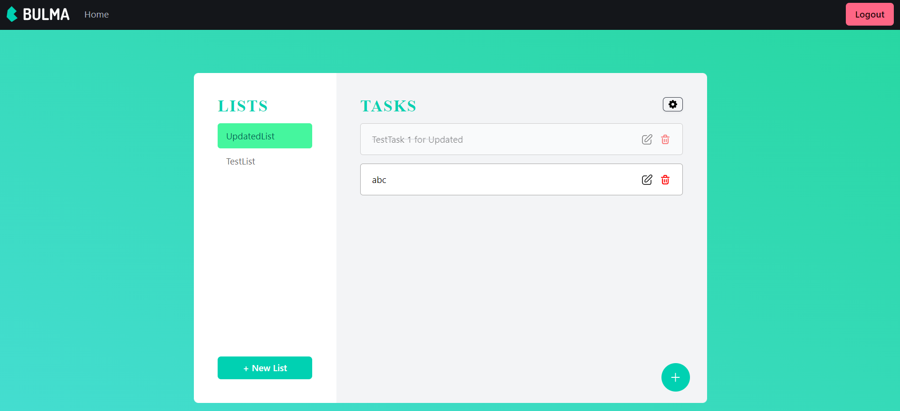

# Task Management App Documentation

This Task Management application is built using the MEAN (MongoDB, Express.js, Angular, Node.js) stack. It provides features for user authentication, creating and managing tasks within lists, and authorization control.

## Features

1. **User Authentication**: Users can sign up and log in securely to access the application.
2. **Authorization**: Implemented authentication and authorization mechanisms to control access to resources.
3. **Task Management**: Users can create, edit, and delete tasks within lists.
4. **List Management**: Users can create and manage lists to organize their tasks efficiently.
5. **Token-Based Authentication**: Implemented token-based authentication with refresh tokens for secure user sessions.

## Starting the Backend Server

To start the backend server, follow these steps:

1. Navigate to the root directory of your backend project where `server.js` is located.
2. Install the required dependencies using npm:
3. Start the server using nodemon:

The backend server will start running on `http://localhost:8000`.

## Starting the Angular Frontend

To start the Angular frontend, follow these steps:

1. Navigate to the root directory of your Angular project.
2. Install the required dependencies using npm:
3. Start the Angular development server:

or

`ng serve`

The Angular development server will start running on `http://localhost:4200`. Open this URL in your web browser to access the Task Management application.

## Additional Information

- For unit testing, you can run `ng test` for Angular frontend tests and use appropriate tools for backend testing.
- Ensure that MongoDB is running and accessible for the backend to store data.

;